# 약속: 매일 약을 먹는 나와의 약속

매일 약을 먹는 시간을 기록해보세요.  
당신이 건강을 생각한다면 매일 챙겨먹는 영양제와 약 먹는 시간을 지나치지 마세요! 
복약 시간을 정해주면 약속 시간에 맞춰 알려드려요. 
그리고, 약을 먹은 시간 기록을 타임라인으로 볼 수 있습니다. 

1. 단순한 사용 방법과 함께 정확한 시간을 알려줍니다.
2. 광고 없이 약 기록을 하고 싶을 때 사용해보세요.
3. 모든 정보는 휴대폰에 저장되고 외부로 전송하지 않습니다.

## Screenshots

| 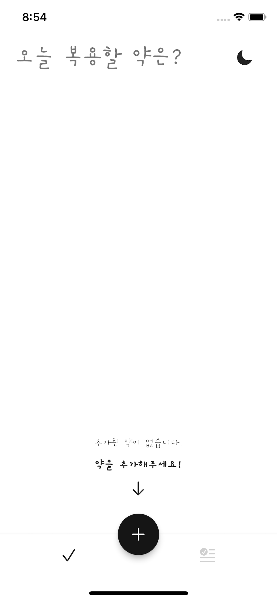 | 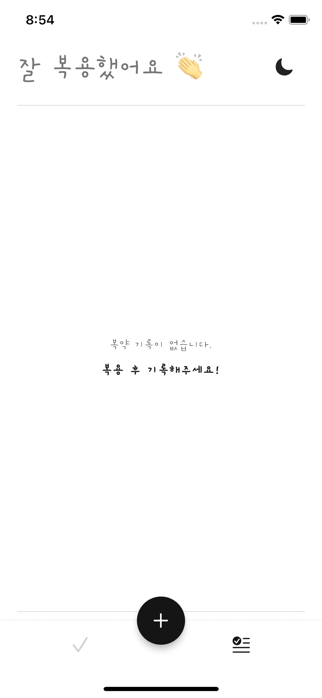 | 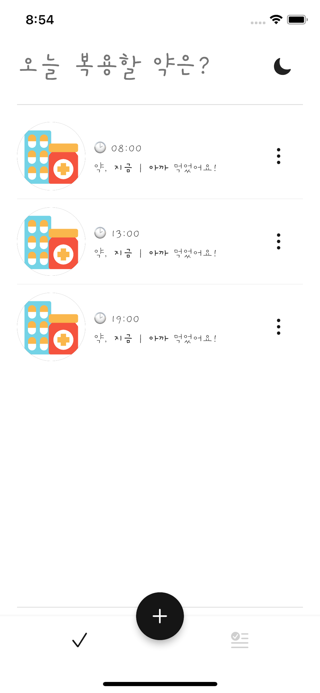 | 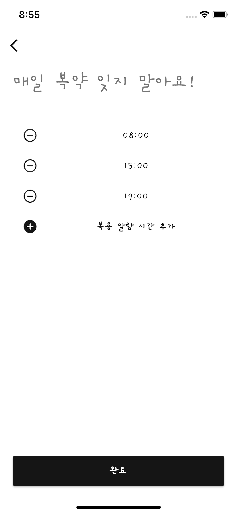 |
|:--:|:--:|:--:|:--:|
| 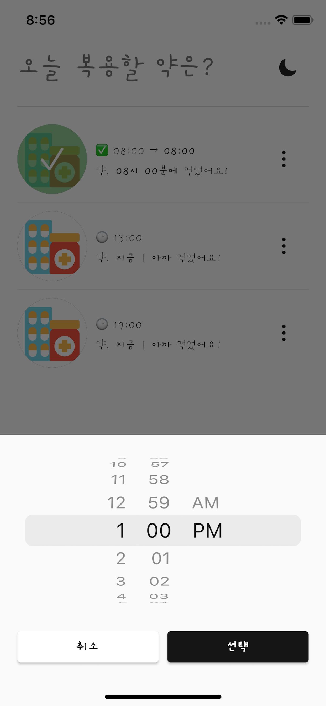 | 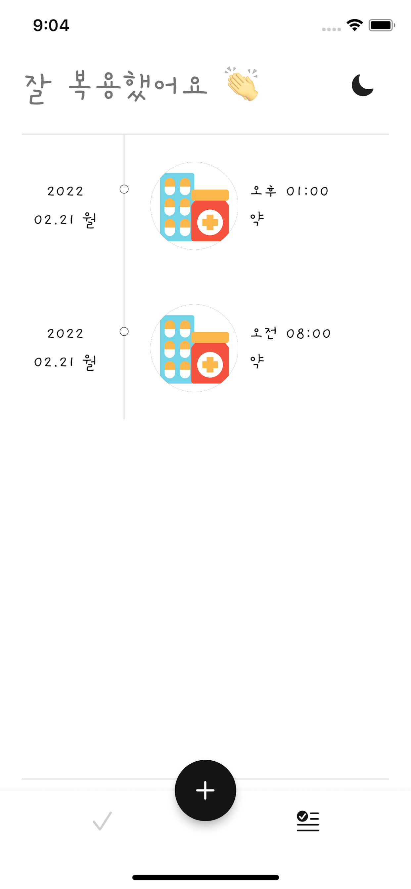 | 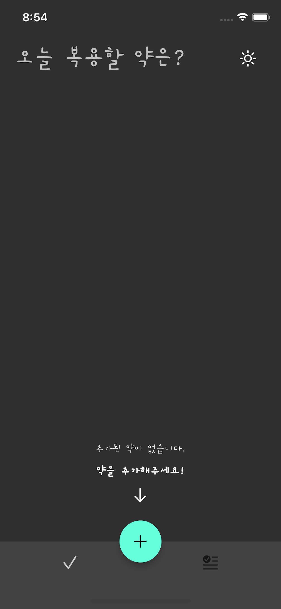 | 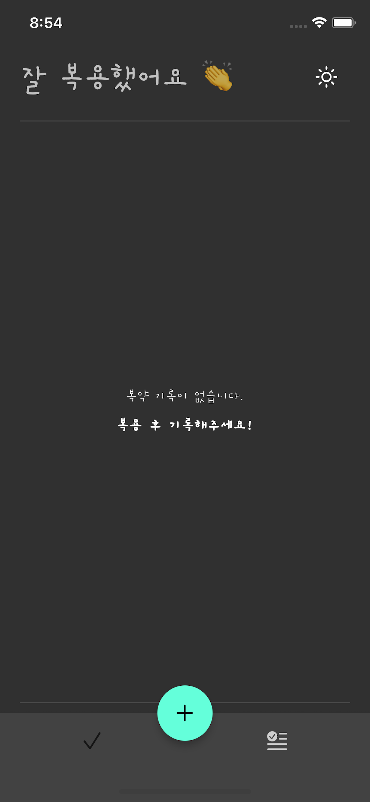 |
| 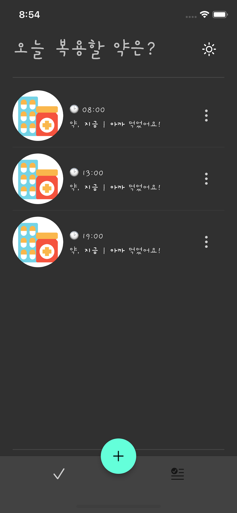 | 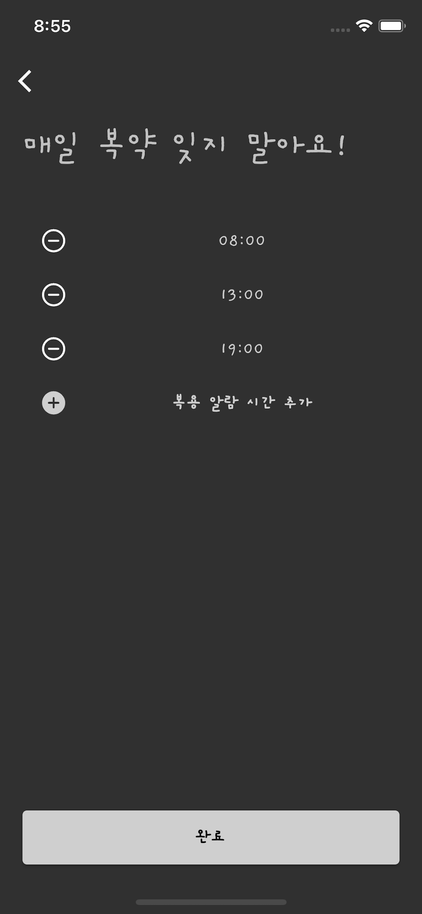 | 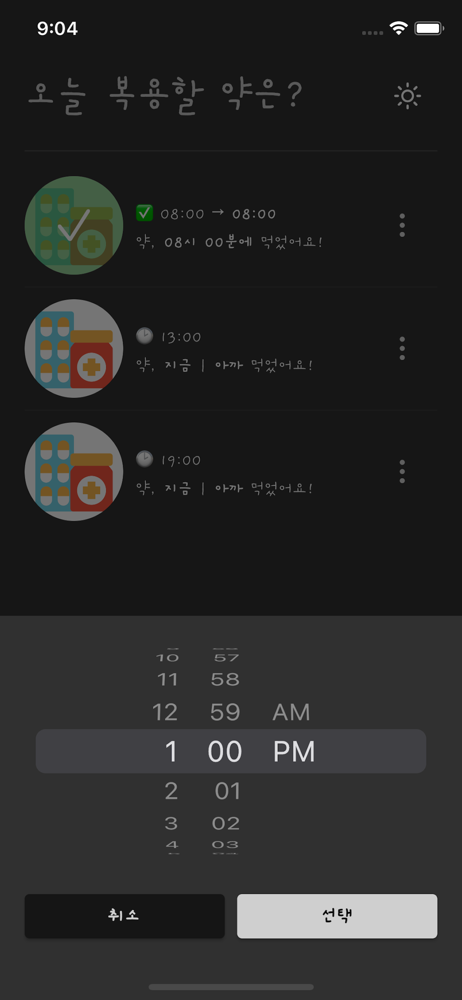 | 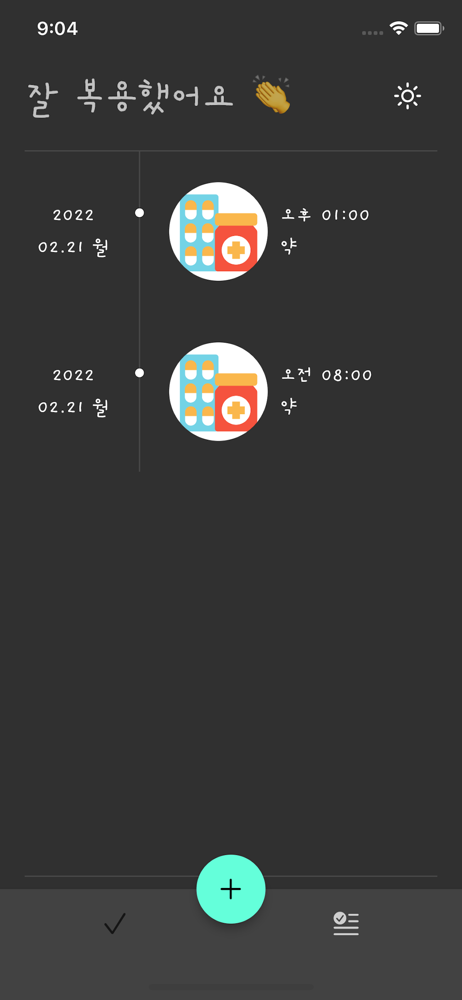 |

## Get the Application

- [App Store (iOS)](https://apps.apple.com/app/%EC%95%BD%EC%86%8D-%EB%A7%A4%EC%9D%BC-%EC%95%BD%EC%9D%84-%EB%A8%B9%EB%8A%94-%EB%82%98%EC%99%80%EC%9D%98-%EC%95%BD%EC%86%8D/id1611014988) _2022/02/23_
- [Googl Play Store (Android)](https://play.google.com/store/apps/details?id=dev.gzupark.timeToPill) _2022/02/28_

## Versions

### 1.0.0

당신의 건강을 위해 정확한 시간에 약을 먹어보세요. 
매일 정확한 시간에 약을 먹는 약속을 지킬 수 있습니다!
